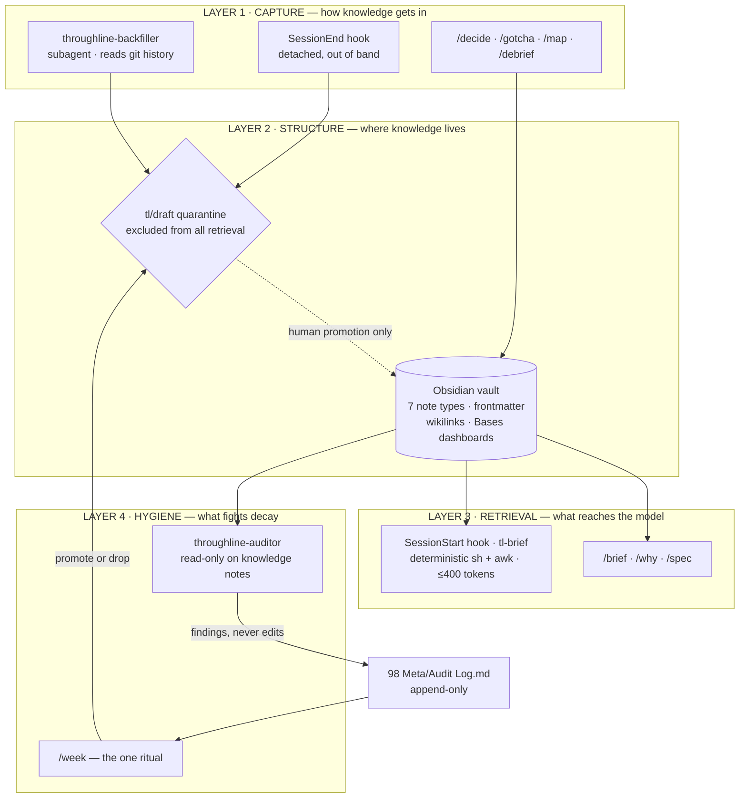
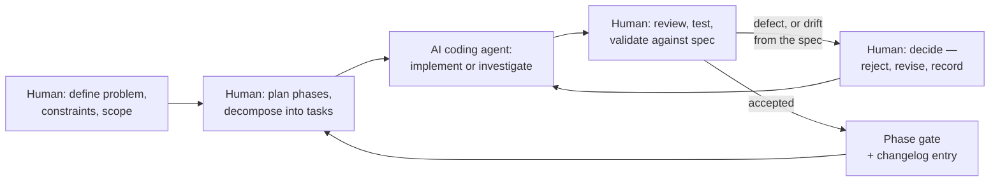

# Throughline

**Engineering memory for AI-assisted development.**
Your code has a git history. Your reasoning has nothing. This is the missing repository.

Throughline is an Obsidian knowledge vault plus a Claude Code plugin. It captures the decisions,
landmines, and dead ends of a coding session as a by-product of the work, then injects only the
relevant slice back into the next session — at most 400 tokens, assembled without a model call.

---

## Overview

Every AI coding session starts from zero. You explain the same constraints, the agent re-proposes
the approach you rejected last month, and it walks into the same bug you spent three hours on in
June. The knowledge existed; nothing kept it.

Throughline is built around one asymmetry:

> **The human should never be asked to write documentation, and the agent should never be given the whole vault.**

Violate the first and the system dies of neglect in two weeks. Violate the second and you have
reinvented context rot with extra steps.

So capture is automatic and generous. Retrieval is deterministic and stingy.

## Why this exists

Existing approaches solve one third of the problem:

| | Capture | Retrieve selectively | Maintain against decay |
|---|---|---|---|
| A `docs/` folder | manual | no | no |
| `CLAUDE.md` | manual | it is always fully in context | no |
| AI note-takers | automatic | usually dumps or embeds everything | no |
| **Throughline** | automatic | deterministic, ≤400 tokens | an auditor that flags, never edits |

The third column is the one nobody attempts. Knowledge decays: a decision gets quietly contradicted
by a commit, a gotcha gets fixed upstream, a component's paths get refactored away. A memory system
that cannot notice this becomes confidently wrong, which is worse than empty.

## What makes it interesting

**The session brief is a shell script, not a model call.** `git` reports which files changed, the
`paths:` property on Component notes maps those files to notes, and `affects:` links fan out to the
Decisions and Gotchas governing them. Pure path matching in `sh` and `awk`. That makes the brief
instant, free, and *structurally incapable of inventing a decision you never made.* A
model-generated brief cannot make that promise.

**The draft quarantine is what makes automatic capture safe.** Every note written by automation
carries `source: agent` and a `#tl/draft` tag, and drafts are excluded from every retrieval path. No
skill, hook, or subagent may remove that tag — promotion is a human action, without exception.
Without this rule, auto-capture poisons the vault within a month, and a memory you cannot trust is
worse than no memory at all.

**The auditor flags and never modifies.** It reads the vault against the real codebase and writes
findings to an append-only log. It does not tag, edit, promote, rename, or delete a knowledge note.
This was a deliberate override of the original design, which had the auditor applying tags directly;
the trade — losing some dashboard automation in exchange for the guarantee that no automated process
ever edits knowledge — is recorded in the
[vault changelog](vault/Throughline/98%20Meta/Vault%20Changelog.md).

**`source` is a first-class trust property.** Every note records whether it came from a `human`, an
`agent`, or a `backfill` reconstruction from git history. You can always see, at a glance, whether a
claim was made by a person or inferred by a model.

**Restraint is enforced, not just intended.** Two hooks, not five. Twelve skills out of twenty-six
designed workflows. `tools/tl-validate` fails if those counts drift.

## Architecture

Four layers. The boundaries between them are the design.



The layers correspond to three verbs, in order of how much they matter:

1. **Capture** automatically, from the work itself. A session ends; a draft note appears. You did
   nothing.
2. **Retrieve** selectively, at the moment of need. The slice that matters, and nothing else.
3. **Maintain** actively, because knowledge decays. This is where nobody else even starts.

## How it works

**At session start.** The `SessionStart` hook runs `bin/tl-brief`. It reads `.throughline` in the
repo root to resolve the project and vault, asks `git` what changed, matches those paths against
Component notes, follows `affects:` to the active Decisions and open Gotchas, and reads the
`open_threads` property — and only that property — from the last session on this branch. If nothing
matches, it prints nothing. Every failure path exits 0, so the hook can never block a session.

**During the session.** Twelve skills, invoked as `/throughline:<name>`. Six cover most use:
`brief`, `why`, `decide`, `gotcha`, `map`, `audit`. The rest are discovered from
`/throughline:help` when needed.

**At session end.** The `SessionEnd` hook applies two guards — fewer than three tool calls, or no
file changes, means nothing worth recording — and otherwise spawns headless Claude Code *detached*
to write a Session note out of band. Your session ends immediately either way. The Session log is
evidence, so it carries `source: agent` but no draft tag; any additional Decision or Gotcha it emits
is knowledge, so it is quarantined.

**Once a week.** Open `Needs Review`, promote the drafts worth keeping, drop the rest. That is the
entire maintenance burden. One ritual is sustainable; five are not.

## Key features

- **12 skills** — `init`, `help`, `decide`, `gotcha`, `map`, `brief`, `why`, `spec`, `debrief`,
  `week`, `audit`, `backfill`
- **2 subagents** — `throughline-auditor` (read-only decay detection) and `throughline-backfiller`
  (reconstructs a vault from git history, so it starts full instead of empty)
- **2 hooks** — `SessionStart` context brief, `SessionEnd` distillation. No others, deliberately.
- **7 note types** — decision, component, gotcha, session, spec, term, practice. Reached by
  subtraction from an initial fourteen; every type that could not justify a distinct retrieval query
  was merged or cut.
- **7 Bases dashboards**, including the `Needs Review` hygiene queue that drives the weekly ritual
- **Zero Obsidian community plugins** and **zero MCP servers**. The vault opens pre-configured.
- **~990 tokens always-on** context cost for the whole plugin, as reported by
  `claude plugin details throughline`

## Project structure

```
.claude-plugin/marketplace.json   makes this repo installable as a plugin marketplace
plugin/throughline/               the Claude Code plugin
  .claude-plugin/plugin.json      plugin manifest
  bin/tl-brief                    SessionStart brief — deterministic, no model call
  bin/tl-session-end              SessionEnd distillation trigger — detached spawn
  hooks/hooks.json                exactly two hooks
  skills/                         12 skills, one SKILL.md each
  agents/                         2 subagent definitions
vault/Throughline/                the hub vault — one vault, all projects, one graph
  00 Command/                     Home, Today, and 6 Bases dashboards
  01 Projects/example-api/        a worked example: 3 components, 4 decisions, 3 gotchas,
                                  1 spec, 2 sessions — including a real supersession chain
  02 Domain/  03 Practices/       domain vocabulary and earned rules, shared across projects
  04 Briefs/                      generated context packets — derived, gitignored
  90 Templates/                   the 7 note templates
  98 Meta/                        how it works, note reference, changelog, audit log, VERIFY
tools/tl-validate                 static validation gate for the whole repository
docs/  starter/  lite/            reserved and empty — see Current status
```

## Getting started

Requires **Obsidian 1.10+** (Bases is a core plugin from 1.9; the list views need 1.10 — built and
tested against 1.13.7), **git**, and **Claude Code** for the plugin tier. On Windows the hooks are
POSIX shell and need Git Bash or WSL.

**1 · Open the vault.** Obsidian → *Open folder as vault* → `vault/Throughline`.

Start at `00 Command/Home.md`, then open
`01 Projects/example-api/Gotchas/G-0001 Redis TTL silently resets on SET.md`. That one note teaches
the system faster than any manual.

**2 · Install the plugin.** From the repository root:

```bash
claude plugin marketplace add ./
```

```bash
claude plugin install throughline@throughline
```

**3 · Tell Throughline where the vault is.** Vault resolution goes `$THROUGHLINE_VAULT` → the
`vault:` line in the repo's `.throughline` → `~/Throughline`. On a fresh clone the vault sits inside
the repository rather than at the fallback path, so set the variable once, in your shell profile:

```bash
export THROUGHLINE_VAULT="/absolute/path/to/Throughline/vault/Throughline"
```

Skip this only if you move or symlink `vault/Throughline` to `~/Throughline`. Without one of the
two, `/throughline:init` reports that no vault was found, and the SessionStart hook stays silent —
by design, since it can never block a session.

**4 · Point a repository at the vault.** In any project you want tracked, start Claude Code and run:

```
/throughline:init
```

That writes a `.throughline` pointer file in the repo root, with an explicit `vault:` line, and
creates the project's partition in the vault. Then map your main source directory, which is what the
whole retrieval layer joins against:

```
/throughline:map src/
```

The vault is fully usable without the plugin — open `90 Templates/` and write a note by hand. The
plugin only removes the typing.

## Example: what the SessionStart brief actually produces

A repository whose `.throughline` points at the example project, on branch `feat/session-postgres`,
with `src/auth/session.ts` modified:

```
THROUGHLINE * example-api * feat/session-postgres

  2 active decision(s) touch your changed files
    [[D-0001 Route all database access through the repository layer]]  reversal_cost: high
    [[D-0004 Move session storage to Postgres]]  reversal_cost: medium

  1 open gotcha(s) in files you are changing
    [[G-0001 Redis TTL silently resets on SET]]  high  cost: 3h

  From your last session:
    ... migration script untested against prod schema
    ... in-process session cache must be removed in the same change as the store swap, or the logout race survives the migration

  Run /throughline:brief <area> for depth.
```

What is *absent* is the more interesting half:

- **D-0002** (*Store sessions in Redis with a sliding TTL*) governs the same component, but is
  `status: superseded`. Only current decisions reach the model.
- **G-0003** (*Logged-out sessions still resolve for up to 30 seconds*) is `status: open` and
  affects the same component as G-0001. It is excluded solely because it carries `#tl/draft` — the
  quarantine doing its job.
- **D-0003** and **G-0002** govern the billing component, which this branch never touched.

## Validation

Separated by kind, because the kinds are not equally strong.

**Static checks — automated and reproducible.**

```bash
sh tools/tl-validate
```

It parses both hook scripts with `sh -n`, validates all three JSON manifests, asserts the plugin
inventory (12 skills / 2 subagents / 2 hooks / 0 MCP servers), checks that every skill declares
`name` and `description`, parses the frontmatter of all 32 vault notes, resolves every wikilink
against the 32 notes and 7 base files — ignoring wikilinks inside code spans, which are
documentation *about* the syntax — and greps the retrieval path to confirm the draft quarantine is
still enforced. It exits non-zero on failure; that path was exercised by injecting a broken wikilink
and confirming the non-zero exit, then reverting.

**Manifest validation — first-party tooling.** `claude plugin validate .` and
`claude plugin validate plugin/throughline` both pass. `claude plugin details throughline` reports
the inventory independently: 12 skills, 2 agents, 2 hooks, 0 MCP servers, 0 LSP servers.

**Behavioural testing — disposable repository.** `bin/tl-brief` was run against a throwaway git repo
wired to the example project. Verified: the correct decisions and gotchas are selected by path
match; superseded decisions are excluded; `#tl/draft` notes are excluded even when they affect a
matched component; unrelated components are excluded; `open_threads` is read from the
branch-matching session and the session body never is. The guard paths — no `.throughline`, not a
git repository, clean working tree — each exit 0 silently, as specified.

`bin/tl-session-end` was exercised on its guard paths; a transcript below the tool-call threshold is
correctly skipped. Live end-to-end distillation was verified during Phase 3 development across three
runs, recorded in the [vault changelog](vault/Throughline/98%20Meta/Vault%20Changelog.md) v0.1.4.

**Known limitations of this validation.**

- **Obsidian Bases dashboards cannot be rendered headlessly.** Whether the seven `.base` files
  actually display is checked by hand against
  [`98 Meta/VERIFY.md`](vault/Throughline/98%20Meta/VERIFY.md). Two known cosmetic gaps are recorded
  there and in the changelog: Gotcha severity sorts alphabetically rather than semantically, and
  `_Projects.base` ships without a per-project note count because Bases has no folder aggregation.
- **The 12 skills and 2 subagents are prompt contracts, not code.** Their behaviour is defined by
  the constraints written into each `SKILL.md`; there is no automated test that a model honours
  them. They have been exercised interactively, not systematically.
- **There is no test suite in the conventional sense** — no unit tests, no CI. `tools/tl-validate`
  is a static gate, not a substitute for one.
- **Tested on one machine:** Windows 11 with Git Bash, Obsidian 1.13.7.

## Current status

Prototype. Phases 1–3 are complete and the system runs end to end.

**Implemented**

- The vault: 7 note types, 7 templates, 7 Bases dashboards, hub notes, and a worked example
- The plugin: 12 skills, 2 subagents, 2 hooks, and both hook scripts
- Marketplace manifest — installable, and verified locally
- `tools/tl-validate` static gate

**Deliberately deferred**

- `docs/` — quickstart, manual, and methodology write-ups
- `starter/` — the 14 non-skill workflows as copy-paste prompts
- `lite/` — a reduced free tier

These three directories are empty on purpose rather than abandoned. The
[Workflow Cheat Sheet](vault/Throughline/98%20Meta/Workflow%20Cheat%20Sheet.md) lists all 26
designed workflows and marks which twelve ship as skills; the other fourteen stay as documented
prompts until real usage shows which deserve promotion. That is deliberate — the next version's
roadmap gets written by observing usage instead of guessing.

## Roadmap

Future work, in rough order of expected value. None of it is started.

- **W10 Gotcha Guard** — a warning before you edit a file with an open gotcha on it. Designed, and
  deliberately unbuilt: it needs a third hook, and the two-hook constraint is load-bearing until
  there is evidence a third earns its keep.
- **W23 Post-Incident Capture** — an incident timeline distilled into gotchas.
- **The remaining 14 workflows** as copy-paste prompts in `starter/`.
- **Semantic retrieval.** The current brief is exact path matching, which is why it is trustworthy
  and also why it misses a decision recorded against a since-renamed directory. Embeddings would
  improve recall at the cost of the "cannot invent a decision you never made" guarantee. If it is
  ever built it belongs *beside* the deterministic brief as an opt-in second pass, never replacing
  it.
- **Cross-project practice extraction** — recurring gotchas graduating into shared Practices
  automatically rather than by hand.
- **Multi-machine vault sync**, which today is whatever the user already uses for the folder.

## Authorship

**Amirhossein Bazdar** — *Project Lead · AI-Assisted Development*

Throughline was developed by one person using AI coding agents — primarily Claude Code — as
development tools. The product direction, system structure, and engineering decisions are human.
Most of the implementation was written by an agent working against written requirements, then
reviewed, tested, and corrected before it was accepted.

What that covered:

- the original idea, and the product definition it became
- requirements, constraints, and what the system deliberately does *not* do
- the overall structure — four layers, and the boundaries between them
- the vault's information architecture and UI/UX direction: 7 note types, 7 templates, the Bases
  dashboards, and the reading path a new user is walked through
- breaking the work into phases, and each phase into concrete implementation tasks
- writing those tasks up for the coding agent, then reviewing and testing what came back
- validating behaviour against the specification, and finding the defects, inconsistencies, and
  deviations from it
- scope and architecture calls: what ships, what is deferred, what is rejected outright

### How the work was done

The loop below is the working pattern, not an idealised one. The decisions it produced are visible
in the repository.



Decisions made by hand, and where the repository shows each one:

| Decision | Evidence in the repository |
|---|---|
| The auditor must never edit a knowledge note | Overrides the original design, which had it applying tags directly. Reasoned through in the changelog, with the cost stated plainly rather than hidden. |
| Session notes are evidence, not quarantined knowledge | A provenance distinction found by running the system and noticing the hygiene queue would ignore the very notes it was tagging. |
| Two hooks, never more | Written into `hooks.json` as a stated product rationale, and asserted by `tools/tl-validate`. |
| Ship 12 skills, not 26 | Fourteen designed workflows stay as prompts until usage justifies promotion. |
| Seven note types, down from fourteen | Every type that could not justify a distinct retrieval query was merged or cut. |
| Dashboards embed, never restate, their filters | A defect caught on inspection: `Home.md` had copied a six-clause filter that was free to drift from the real one. |

Every departure from the original specification is recorded in the
[vault changelog](vault/Throughline/98%20Meta/Vault%20Changelog.md) with its reason — including the
ones that made the product worse along some dimension. Nothing was dropped silently. That log, more
than any individual feature, is the artefact worth reading.

---

*Prototype. Not deployed, not published, and not licensed for redistribution.*
